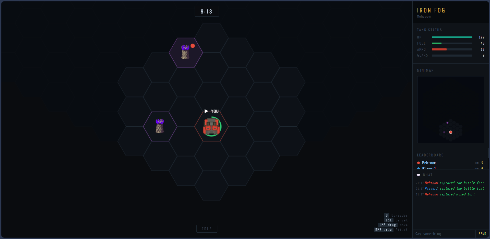
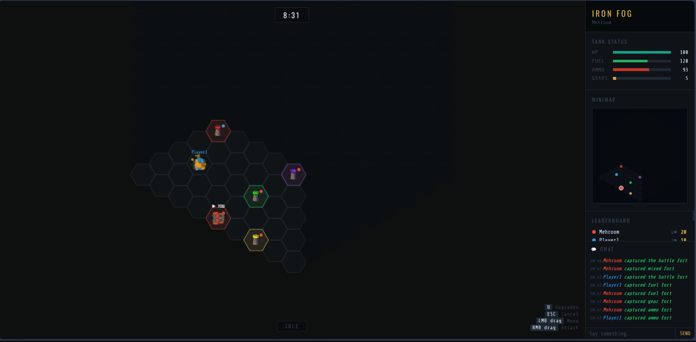
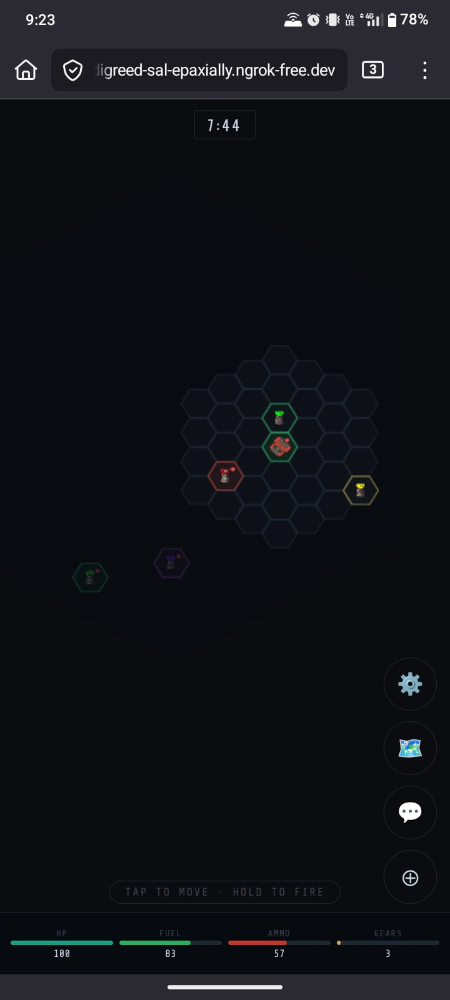
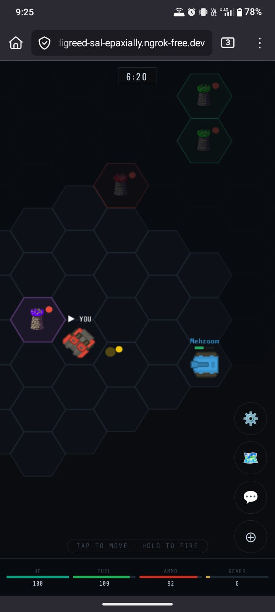

# ⚔️ IRON FOG
### Tactical Hex Warfare — Real-time Multiplayer Tank Combat

> *Capture forts. Manage resources. Outlast your enemies in the fog of war.*

---

## 📸SCREENSHOTS 





---

## 🗺️ Overview

Iron Fog is a browser-based real-time multiplayer tank game played on a hex grid shrouded in fog of war. Up to **4 players** fight to capture resource forts, upgrade their tanks, and dominate the map before the 10-minute match clock runs out.

Every decision matters — fuel limits how far you roam, ammo limits how freely you fight, and dying costs you your outer forts. There's no turtling, no coasting. You're always one bad engagement away from losing your empire.

---

## ✨ Features

- 🌫️ **Fog of War** — you only see 3 hexes around your tank; intel is everything
- 🏰 **12 Forts** across 4 types — Fuel, Ammo, Gear, and Mixed
- ⚙️ **5 Upgrades** — Engine, Armor, Cannon, Sensor, Loader (3 levels each)
- 💀 **Death Penalty** — lose your outer forts and half your resources on death
- 🔒 **Recapture Penalty** — retaking an owned fort takes 1.5× longer
- 🏆 **Live Leaderboard** — score by kills and captures, top score wins
- 💬 **In-game chat** + kill/capture feed
- 🔁 **Auto-rematch** vote system after each match
- 📱 **Mobile browser support** — full gameplay on phone, no app install needed

---

## 📁 Folder Structure

```
iron-fog/
│
├── server/
│   └── server.py          # Game server — WebSocket + HTTP on port 8080
│
└── web/
    ├── index.html         # Entire game client (single file)
    ├── favicon.ico        # Browser tab icon
    │
    └── assets/
        ├── fort_ammo.png  # Ammo fort icon
        ├── fort_fuel.png  # Fuel fort icon
        ├── fort_gear.png  # Gear fort icon
        ├── fort_mixed.png # Mixed fort icon
        ├── tank_self.png  # Your tank sprite
        └── tank_enemy.png # Enemy tank sprite
```

> Assets are optional — the game falls back to programmatic drawing if images are missing.

---

## ⚙️ Installation

### Requirements

- Python **3.10+**
- `websockets` library

### 1. Clone the repo

```bash
git clone https://github.com/yourname/iron-fog.git
cd iron-fog
```

### 2. Install dependencies

```bash
pip install websockets
```

### 3. Run the server

```bash
python server/server.py
```

You should see:

```
[...] Iron Fog starting on port 8080
[...] Ready!
[...] Local:   http://localhost:8080
[...] Friends: ngrok http 8080  →  share that URL
```

### 4. Open the game

Open **http://localhost:8080** in your browser. Done.

---

## 🌐 Multiplayer with Friends

The server only runs locally by default. To play with friends online, use [ngrok](https://ngrok.com/) to expose your port:

```bash
# In a separate terminal
ngrok http 8080
```

Share the `https://xxxx.ngrok.io` URL with your friends — they open it in their browser and they're in. **Works on mobile too** — no app, no install, just the link.

---

## 🕹️ How to Play

### Desktop Controls

| Input | Action |
|---|---|
| `LMB drag` | Move tank — drag from your tank toward destination |
| `RMB drag` | Attack — drag toward target hex |
| `U` | Open / close Upgrades panel |
| `Space` | Center camera on your tank |
| `Scroll` | Zoom in / out |
| `Middle mouse drag` | Pan camera |
| `Esc` | Cancel action / close panel |
| `H` | Show controls hint |

### 📱 Mobile Controls

No app download, no setup — just open the link in your mobile browser and play. The entire game is available with a touch-native control scheme, nothing is locked behind desktop.

| Gesture | Action |
|---|---|
| **Tap** any hex | Move your tank there |
| **Hold** any hex (~0.4s) | Fire at that hex — a red ring confirms the shot |
| **Two-finger drag** | Pan the camera |
| **Pinch in / out** | Zoom |
| **⚙️ button** | Open Upgrades |
| **🗺️ button** | Open map, leaderboard & fort list |
| **💬 button** | Open chat (badge shows unread messages) |
| **⊕ button** | Center camera on your tank |

> A pill at the bottom edge always shows your current action state. HP, Fuel, Ammo and Gears are pinned to the bottom of the screen at all times so resource management is never more than a glance away.

### Capturing a Fort

Roll your tank onto a fort hex and **stand still**. A circular progress arc fills around the fort — leave before it completes and progress decays. If an enemy steps on the same fort, progress stalls.

- Neutral fort → **5 seconds** to capture
- Previously owned fort → **7.5 seconds** (🔒 icon shown)

---

## 🎯 Objective

Score the most points before the **10-minute** match timer hits zero.

| Action | Points |
|---|---|
| Destroy an enemy tank | **+10** |
| Capture a fort | **+5** |

### Fort Types

| Icon | Type | Generates |
|---|---|---|
| 🟢 Fuel | `fuel` | Fuel over time |
| 🔴 Ammo | `ammo` | Ammo over time |
| 🟡 Gear | `gear` | Gears (for upgrades) |
| 🟣 Mixed | `mixed` | Fuel + Ammo + Gears |

Own more forts → generate more resources → upgrade faster → win.

---

## ⚙️ Upgrades

Spend **Gears** (earned from Gear/Mixed forts) at the upgrade panel (`U` on desktop, ⚙️ on mobile).

| Upgrade | Effect per level | Cost (Lv 1 / 2 / 3) |
|---|---|---|
| 🔧 Engine | +20% move speed | 5 / 10 / 18 gears |
| 🛡️ Armor | +20 max HP | 5 / 10 / 18 gears |
| 💥 Cannon | +10 shell damage + 1 range | 5 / 10 / 18 gears |
| 📡 Sensor | +1 vision range | 5 / 10 / 18 gears |
| 🔄 Loader | −2 ammo cost per shot | 5 / 10 / 18 gears |

Max level is **3** for each upgrade.

---

## 💀 Death & Loot

When your tank is destroyed:

- You **keep your 2 closest forts** — the rest go neutral and become contestable immediately
- You lose **half your fuel** (floor: 15) and **half your ammo** (floor: 10)
- You lose **half your gears** (no floor — can be zeroed)
- The killer receives a cut of your stolen resources as loot
- You respawn after **8 seconds** at a random edge spawn

> Death is a setback, not an elimination. But losing your outer forts while dead means they'll be recaptured before you're back — dying mid-map is always costly.

---

## 🔧 Configuration

All game constants live at the top of `server/server.py`:

```python
CAPTURE_TIME    = 5.0    # seconds to capture a neutral fort
MAX_PLAYERS     = 4      # max players per match
MATCH_TIME      = 600.0  # match duration in seconds
RESPAWN_TIME    = 8.0    # seconds before respawn
FORT_COUNT      = 12     # total forts on the map
FOG_RANGE       = 3      # visibility radius in hexes

# Resources
FUEL_PER_HEX    = 4      # fuel consumed per hex of movement
FORT_FUEL_GEN   = 0.7    # fuel generated per second per fuel fort
FORT_AMMO_GEN   = 0.9    # ammo generated per second per ammo fort
FORT_GEAR_GEN   = 0.10   # gears generated per second per gear fort
```

---

## 📜 License

MIT — do whatever you want with it.

---

<div align="center">
  <sub>Built with Python + WebSockets + Canvas API. No frameworks. No dependencies on the client.</sub>
</div>
